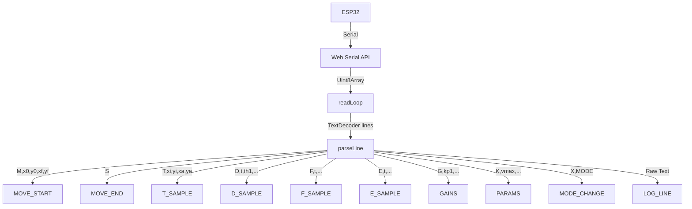

# SCARA HMI: Stack and Architecture Reference

This document recaps the technical stack, directory layout, core architecture, and state management of the SCARA Robot HMI.

---

### 1. Technology Stack

* **Framework**: [Next.js v16.2.6](https://nextjs.org) (App Router, client-side shell + Server Actions & API Router).
* **Library**: [React v19.2.4](https://react.dev) with Context + Reducer state management.
* **Database**: [Turso/LibSQL](https://turso.tech) (Edge SQLite) with [Drizzle ORM v0.45.2](https://orm.drizzle.team) for database schema mapping, migrations, and queries.
* **Authentication**: [NextAuth.js v5 (auth.js)](https://authjs.dev) using Google OAuth credentials provider.
* **Language**: [TypeScript v5](https://www.typescriptlang.org/).
* **Styling**: [Tailwind CSS v4](https://tailwindcss.com/) — dark industrial theme.
* **Hardware Interface**: [Web Serial API](https://developer.mozilla.org/en-US/docs/Web/API/Web_Serial_API) at **921600** baud.
* **Visualizations**:
  * **HTML5 Canvas** — real-time workspace tracing (`XYTrace`) and historic workspace overlay (`DashboardXYTrace`).
  * **Recharts v3.8.1** — telemetry charts, FFT, control effort, and diagnostic plots.
* **UI Components**: Radix UI primitives (Collapsible, Dialog, Select, Sheet, Tabs, Tooltip) + Lucide Icons.
* **Notifications**: Sonner toast library for `INFO:`, `WARN:`, and `ERR:` serial messages and save/load status banners.

---

## 2. Directory Layout

```text
hmi/
├── app/                              # Next.js App Router
│   ├── actions/                      # Next.js Server Actions
│   │   └── experiment.ts             # Server actions to save automated experiment runs
│   ├── api/                          # Next.js REST API routes
│   │   ├── auth/                     # NextAuth API endpoints
│   │   │   └── [...nextauth]/route.ts
│   │   └── runs/                     # Runs REST endpoints
│   │       ├── route.ts              # POST /api/runs (save run)
│   │       └── [id]/route.ts         # GET /api/runs/[id] (fetch single run with data)
│   │   └── ...
│   ├── dashboard/                    # Saved Runs history route (/dashboard)
│   │   ├── page.tsx                  # Server component fetching initial runs
│   │   └── dashboard-content.tsx     # Client UI managing run comparison tabs
│   ├── eksperimen/                   # Automated experiment route (/eksperimen)
│   │   ├── page.tsx                  # Protected page component
│   │   └── experiment-client.tsx     # State machine running automated sequence loops
│   ├── hasil-eksperimen/             # Experiment results visualization route (/hasil-eksperimen)
│   │   ├── page.tsx
│   │   └── results-client.tsx        # Comparative data analytics and filtering viewer
│   ├── login/                        # Google Authentication route (/login)
│   │   ├── page.tsx
│   │   └── login-content.tsx
│   ├── globals.css                   # Tailwind v4 theme and custom colors
│   ├── layout.tsx                    # Root shell + Providers wrapper
│   ├── page.tsx                      # Home route → HMIRoot
│   └── providers.tsx                 # HMIProvider, ModeRouter, KeybindingsHandler
├── components/
│   ├── dashboard/                    # History analysis dashboard specific tabs
│   │   ├── advanced-tab.tsx          # Execution times and CTC forces plots
│   │   ├── chart-card.tsx            # Generic wrapper card for dashboard charts
│   │   ├── dashboard-xy-trace.tsx    # Multi-run XY canvas comparison overlay
│   │   ├── feedforward-tab.tsx       # Comparative feedforward torque component charts
│   │   ├── metrics-tab.tsx           # Comparative tabular metrics spreadsheet
│   │   ├── pid-tab.tsx               # Joint 1 PID tracking and CTE charts
│   │   ├── run-selector.tsx          # Sidebar selection panel for saved runs
│   │   ├── trajectory-tab.tsx        # XY canvas tab layout
│   │   └── velocity-tab.tsx          # Desired vs actual joint velocities
│   ├── hmi/                          # Core live HMI features
│   │   ├── hmi-root.tsx              # Home shell (4 tabs)
│   │   ├── monitor-tab.tsx           # Live monitoring layout
│   │   ├── analysis-tab.tsx          # Post-run diagnostics layout
│   │   ├── zn-analysis-tab.tsx       # Rest Analysis tab
│   │   ├── zn-tuner-tab.tsx          # ZN page tuner workspace
│   │   ├── adv-tuner-tab.tsx         # Test page params tuner
│   │   ├── run-button.tsx            # Dual-mode move dispatch: Run / Run + Save to DB
│   │   ├── save-run-dialog.tsx       # Confirmation dialog prompt for saving runs
│   │   ├── chart-panel.tsx           # Telemetry charts + MetricsPanel
│   │   ├── xy-trace.tsx              # Canvas workspace map
│   │   ├── control-panel.tsx         # PID, moves, feedforward
│   │   ├── advanced-analysis.tsx     # CTC, effort, loop duration sections
│   │   └── ...
│   └── ui/                           # Atomic Radix + Tailwind wrappers
├── hooks/
│   └── use-heartbeat.ts              # Periodic ping to firmware watchdog
├── lib/
│   ├── db/                           # Drizzle database configuration
│   │   ├── schema/                   # Sub-schemas
│   │   │   └── experiment.ts         # Automated experiment runs & metrics table models
│   │   ├── index.ts                  # Turso Client connection export
│   │   ├── queries.ts                # Database query utils (saves, lists, deletes runs)
│   │   ├── backup.ts                 # Local JSONL file backup utilities
│   │   └── schema.ts                 # Core runs, users, samples schemas
│   ├── hmi-context.tsx               # Global state, Web Serial read-loop
│   ├── hmi-types.ts                  # State and sample interfaces
│   ├── telemetry-types.ts            # Auto-generated telemetry field types
```

---

## 3. Multi-Route Architecture & Auth Boundary

```
┌───────────────────────────────────────────────────────────────────┐
│  app/layout.tsx → Providers (HMIProvider / NextAuth Session)     │
│    ├── ModeRouter        — sends mode,scara|zn|test per URL       │
│    ├── KeybindingsHandler                                         │
│    ├── CaptureChartsHost — hidden export render targets           │
│    └── {children}                                                 │
│         ├── /                  → HMIRoot (Home dashboard)         │
│         ├── /zn                → ZNTunerShell (ZN Joint Tuner)    │
│         ├── /test              → TestTunerShell (Test page)       │
│         │                                                         │
│         ├─ 🔓 Public Access Boundaries                            │
│         │    ├── /login        → Google Authentication Portal    │
│         │    └── /hasil-eksperimen → Automated Results Analytics  │
│         │                                                         │
│         ├─ 🔐 Protected Area (Next.js Middleware Boundary)        │
│              ├── /dashboard    → Runs History Compare Dashboard   │
│              └── /eksperimen  → Sequence Automation Tuner         │
└───────────────────────────────────────────────────────────────────┘
```

The Serial Port connection persists across all route changes because the `HMIProvider` lives globally in `app/layout.tsx`. Navigating between routes maintains the active serial connection.

### Next.js Middleware Protection
The `middleware.ts` maps NextAuth router callbacks to verify Google accounts credentials when hitting `/dashboard` or the `/api/runs` write/read REST API. Unauthenticated requests on client routes redirect users directly to `/login`, while API route requests return a `401 Unauthorized` response.

---

## 4. Core State Management & Data Flow

State is managed globally via React Context (`HMIContext`) and a reducer in `hmi-context.tsx`.

### Data Ingestion Flow



### Sampling Rates
* **D packets** arrive at 500 Hz from firmware; the HMI downsamples to 50 Hz (every 10th sample) for chart buffers.
* **T, F, E packets** arrive at 50 Hz natively.
* Chart DOM updates are throttled to 5 Hz (200 ms) during live recording to keep Recharts responsive.

### Buffer Limits
* `MAX_BUFFER = 2000` samples per trajectory run (main HMI charts).
* `MAX_BUFFER = 10000` samples (Rest Analysis / ZN buffer).
* `MAX_LOG_LINES = 100` serial console lines.

---

## 5. Web Serial Connection Lifecycle

1. **Connecting**: `navigator.serial.requestPort()` stores the port descriptor in `localStorage('hmi_lastPort')` and opens at **921600** baud.
2. **Handshake**: Sends `getgains` and `getparams` to sync PID gains and runtime parameters.
3. **Heartbeat**: `useHeartbeat` sends `ping` periodically to prevent the firmware 8-second serial watchdog from returning to IDLE.
4. **Read Loop**: Asynchronous stream reader splits on `\n` and routes lines to `parseLine`.
5. **Plot Mode**: When pathname is `/zn` or `/test`, sends `plot,1`; otherwise `plot,0`.
6. **Auto Reconnect**: On disconnect, status becomes `reconnecting` and polls `navigator.serial.getPorts()` every 2000 ms.

---

## 6. Home Page Tab Structure

| Tab | Component | Purpose |
| :--- | :--- | :--- |
| Monitor | `MonitorTab` | Live XY trace, charts, metrics, control panel |
| Analysis | `AnalysisTab` | Frozen post-run diagnostics |
| Rest Analysis | `ZNAnalysisTab` | Continuous step/rest telemetry analysis |
| README | `ReadmeTab` | In-app documentation |
