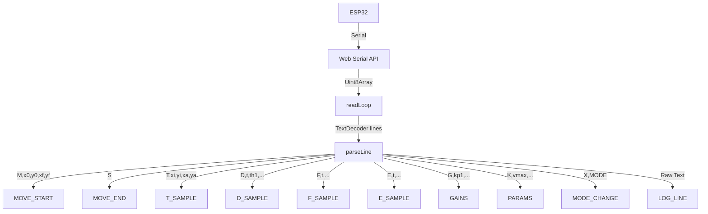

# SCARA HMI: Stack and Architecture Reference

This document recaps the technical stack, directory layout, core architecture, and state management of the SCARA Robot HMI.

---

## 1. Technology Stack

* **Framework**: [Next.js v16.2.6](https://nextjs.org) (App Router, client-side shell).
* **Library**: [React v19.2.4](https://react.dev) with Context + Reducer state management.
* **Language**: [TypeScript v5](https://www.typescriptlang.org/).
* **Styling**: [Tailwind CSS v4](https://tailwindcss.com/) — dark industrial theme.
* **Hardware Interface**: [Web Serial API](https://developer.mozilla.org/en-US/docs/Web/API/Web_Serial_API) at **921600** baud.
* **Visualizations**:
  * **HTML5 Canvas** — real-time workspace tracing (`XYTrace`).
  * **Recharts v3.8.1** — telemetry charts, FFT, and diagnostic plots.
* **UI Components**: Radix UI primitives (Collapsible, Dialog, Select, Sheet, Tabs, Tooltip).
* **Notifications**: Sonner toast library for `INFO:`, `WARN:`, and `ERR:` serial messages.

---

## 2. Directory Layout

```text
hmi/
├── app/                              # Next.js App Router
│   ├── globals.css                   # Tailwind v4 theme and custom colors
│   ├── layout.tsx                    # Root shell + Providers wrapper
│   ├── page.tsx                      # Home route → HMIRoot
│   ├── providers.tsx                 # HMIProvider, ModeRouter, KeybindingsHandler
│   ├── zn/                           # ZN Tuner route (/zn)
│   │   ├── page.tsx
│   │   └── zn-page-content.tsx
│   └── test/                         # Test bench route (/test)
│       ├── page.tsx
│       └── test-page-content.tsx
├── components/
│   ├── hmi/                          # Core HMI features
│   │   ├── hmi-root.tsx              # Home shell (4 tabs)
│   │   ├── monitor-tab.tsx           # Live monitoring layout
│   │   ├── analysis-tab.tsx          # Post-run diagnostics layout
│   │   ├── zn-analysis-tab.tsx       # Rest Analysis tab
│   │   ├── zn-tuner-tab.tsx          # ZN page tuner workspace
│   │   ├── adv-tuner-tab.tsx         # Test page params tuner
│   │   ├── chart-panel.tsx           # Telemetry charts + MetricsPanel
│   │   ├── xy-trace.tsx              # Canvas workspace map
│   │   ├── control-panel.tsx         # PID, moves, feedforward
│   │   ├── advanced-analysis.tsx     # CTC, effort, loop duration sections
│   │   ├── capture-menu.tsx          # Settings sidebar
│   │   ├── capture-charts-host.tsx   # Off-screen chart render host for exports
│   │   ├── serial-terminal.tsx       # Bottom-sheet serial monitor
│   │   ├── serial-log.tsx            # Log console content
│   │   ├── readme-tab.tsx            # In-app user guide
│   │   ├── keybindings-handler.tsx   # Global keyboard shortcuts
│   │   ├── mode-router.tsx           # Auto mode switching per route
│   │   └── ...
│   └── ui/                           # Atomic Radix + Tailwind wrappers
├── hooks/
│   └── use-heartbeat.ts              # Periodic ping to firmware watchdog
├── lib/
│   ├── hmi-context.tsx               # Global state, Web Serial read-loop
│   ├── hmi-types.ts                  # State and sample interfaces
│   ├── telemetry-types.ts            # Auto-generated telemetry field types
│   ├── cte-utils.ts                  # Cross/along tracking error math
│   ├── capture-utils.ts              # PNG/JPEG/ZIP export helpers
│   ├── capture-session.ts            # Export session state
│   ├── keybindings-store.ts          # Keyboard shortcut persistence
│   ├── trajectory-safety.ts          # Move validation rules
│   └── tuning-advisor.ts             # Rule-based PID suggestions
└── types/
    └── web-serial.d.ts               # navigator.serial declarations
```

---

## 3. Multi-Route Architecture

```
┌─────────────────────────────────────────────────────────┐
│  app/layout.tsx → Providers (HMIProvider)             │
│    ├── ModeRouter    — sends mode,scara|zn|test per URL  │
│    ├── KeybindingsHandler                              │
│    ├── CaptureChartsHost — hidden export render targets │
│    └── {children}                                        │
│         ├── /           → HMIRoot (Home)                 │
│         ├── /zn         → ZNTunerShell                   │
│         └── /test       → TestTunerShell                 │
└─────────────────────────────────────────────────────────┘
```

The serial port connection persists across route changes because `HMIProvider` lives in `app/layout.tsx`, not inside individual pages.

---

## 4. Core State Management & Data Flow

State is managed globally via React Context (`HMIContext`) and a reducer in `hmi-context.tsx`.

### Data Ingestion Flow



### Sampling Rates
* **D packets** arrive at 500 Hz from firmware; the HMI downsamples to 50 Hz (every 10th sample) for chart buffers.
* **T, F, E packets** arrive at 50 Hz natively.
* Chart DOM updates are throttled to 5 Hz (200 ms) during live recording to keep Recharts responsive.

### Buffer Limits
* `MAX_BUFFER = 2000` samples per trajectory run (main HMI charts).
* `MAX_BUFFER = 10000` samples (Rest Analysis / ZN buffer).
* `MAX_LOG_LINES = 100` serial console lines.

---

## 5. Web Serial Connection Lifecycle

1. **Connecting**: `navigator.serial.requestPort()` stores the port descriptor in `localStorage('hmi_lastPort')` and opens at **921600** baud.
2. **Handshake**: Sends `getgains` and `getparams` to sync PID gains and runtime parameters.
3. **Heartbeat**: `useHeartbeat` sends `ping` periodically to prevent the firmware 8-second serial watchdog from returning to IDLE.
4. **Read Loop**: Asynchronous stream reader splits on `\n` and routes lines to `parseLine`.
5. **Plot Mode**: When pathname is `/zn` or `/test`, sends `plot,1`; otherwise `plot,0`.
6. **Auto Reconnect**: On disconnect, status becomes `reconnecting` and polls `navigator.serial.getPorts()` every 2000 ms.

---

## 6. Home Page Tab Structure

| Tab | Component | Purpose |
| :--- | :--- | :--- |
| Monitor | `MonitorTab` | Live XY trace, charts, metrics, control panel |
| Analysis | `AnalysisTab` | Frozen post-run diagnostics |
| Rest Analysis | `ZNAnalysisTab` | Continuous step/rest telemetry analysis |
| README | `ReadmeTab` | In-app documentation |
