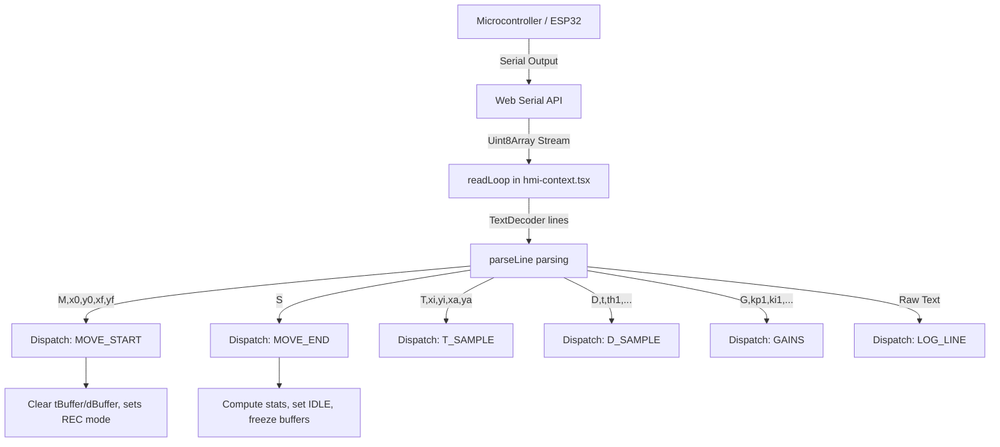

# SCARA HMI: Stack and Architecture Reference

This document recaps the technical stack, directory layout, core architecture, and state management of the SCARA Robot HMI. It is designed to help any developer or AI agent quickly understand the system structure without reading the entire codebase.

---

## 1. Technology Stack

The HMI is built with a modern front-end web stack tailored for industrial telemetry and real-time visualization:

*   **Framework**: [Next.js v16.2.6](https://nextjs.org) (using App Router, client-side shell execution).
*   **Library**: [React v19.2.4](https://react.dev) (for interactive components and context-driven state management).
*   **Language**: [TypeScript v5](https://www.typescriptlang.org/) (for strict typings across serial payloads and components).
*   **Styling**: [Tailwind CSS v4](https://tailwindcss.com/) with a dark, high-contrast, industrial theme design system.
*   **Hardware Interface**: [Web Serial API](https://developer.mozilla.org/en-US/docs/Web/API/Web_Serial_API) (enabling direct serial COM port communication directly from Chrome/Edge).
*   **Visualizations**: 
    *   **HTML5 Canvas**: Performance-optimized real-time drawing for the 2D workspace tracing (`XYTrace`).
    *   **Recharts v3.8.1**: Declarative charting library for plotting step responses, velocities, control efforts, and FFT.
*   **UI Components**: [Radix UI](https://www.radix-ui.com/) primitives (Collapsible, Select, Slot, Tabs, Tooltip) with custom styled-wrappers.

---

## 2. Directory Layout

The codebase has a clean component-driven layout:

```text
├── .next/                  # Next.js build output
├── app/                    # Next.js App Router root
│   ├── favicon.ico
│   ├── globals.css         # Tailwind v4 theme definitions and custom colors
│   ├── layout.tsx          # Root shell layout
│   └── page.tsx            # Standard route page importing HMIRoot
├── components/             # Reusable UI component layer
│   ├── hmi/                # Core HMI features and views
│   │   ├── advanced-analysis.tsx  # FFT and Control Effort Proxy sections
│   │   ├── analysis-tab.tsx       # Layout for the Analysis Tab
│   │   ├── chart-panel.tsx        # Multi-tab line/area charts for telemetry
│   │   ├── comparison-table.tsx   # Detailed sample table with CSV exporter
│   │   ├── control-panel.tsx      # PID inputs, target movement & microstepping forms
│   │   ├── header.tsx             # HMI title & toolbar header
│   │   ├── hmi-root.tsx           # Entry point and general Shell layout
│   │   ├── monitor-tab.tsx        # Layout for the Monitor Tab (Live Telemetry)
│   │   ├── phase-portrait.tsx     # Joint space phase portrait plotting
│   │   ├── serial-log.tsx         # Console/log list for incoming serial text
│   │   ├── step-metrics.tsx       # Step response rise/settling time metrics
│   │   └── xy-trace.tsx           # Canvas-based 2D arm workspace mapping
│   └── ui/                 # Atomic design components (Badge, Button, Card, etc.)
├── lib/                    # Shared libraries and state management
│   ├── hmi-context.tsx     # Main React state Context, Reducer, and Web Serial Loop
│   ├── hmi-types.ts        # TypeScript typings for state, actions, and models
│   └── utils.ts            # Tailwind class union utility (cn)
├── types/                  # Ambient TypeScript declarations
│   └── web-serial.d.ts     # Minimal type declarations for navigator.serial
├── package.json            # Scripts and dependencies
└── tsconfig.json           # TypeScript configuration
```

---

## 3. Core State Management & Data Flow

State is managed globally in client-side memory via React Context (`HMIContext`) and a reducer defined in [hmi-context.tsx](../../hmi/lib/hmi-context.tsx).

### Data Ingestion Flow



### Buffer Limits
To prevent browser memory bloat during high-frequency telemetry logging, buffers are restricted to:
*   `MAX_BUFFER = 2000` (samples per trajectory run).
*   `MAX_LOG_LINES = 100` (lines in the serial console).

---

## 4. Web Serial Connection Lifecycle

The Serial controller handles automatic reconnection and connection handshakes:
1.  **Connecting**: Clicking "Connect" requests a port via `navigator.serial.requestPort()`. It stores the selected COM port descriptor in `localStorage('hmi_lastPort')` and opens it at **921600 baud**.
2.  **Handshake**: Upon opening, it writes `'getgains\n'` to fetch the active PID gains and microstepping configuration from the microcontroller.
3.  **Read Loop**: Reads stream chunks asynchronously, splits them by `\n`, and routes individual strings to the parser.
4.  **Auto Reconnect**: If the port is disconnected abruptly, the status switches to `reconnecting` and a 2000ms polling interval kicks in to re-establish the connection once the device is plugged back in.
